# Data Portfolio - Dawid Wolanin

This is my Cyclistic Capstone Project in the form of a case study, the completion of which is required to achieve the Google Data Analytics Professional Certificate.


# Table of contents 

- [Objective](#objective)
- [Data Source](#data-source)
- [Stages](#stages)
- [Design](#design)
  - [Types of Visuals](#types-of-visuals)
  - [Tools](#tools)
- [Development](#development)
  - [Pseudocode](#pseudocode)
  - [Data Exploration](#data-exploration)
  - [Data Cleaning](#data-cleaning)
  - [Data Transformation](#data-transformation)
- [R code](#r-code)
  - [Preparation](#preparation)
  - [Calculation and Visuals](#calculation-and-visuals)
  - [Data Quality Tests](#data-quality-tests)
- [Tableau Visualization](#tableau-visualization)
  - [Results](#results)
- [Analysis](#analysis)
  - [Findings](#findings)
  - [Discoveries](#discoveries)
- [Recommendations](#recommendations)
  - [Potential Courses of Actions](#potential-courses-of-actions)
- [Conclusion](#conclusion)


# Objective
- What is the main goal of the analysis?

The director of marketing of Cyclistic, a fictional bike-share company in Chicago, has set a clear goal: convert casual riders into annual members. The marketing team needs to better understand how annual members and casual riders use Cyclistic bikes differently in order to design appropriate marketing strategies. My task as a data analyst working on the team is to create a report which will help the company's executives make informed decisions.

- What does the ideal solution include?

A report containing a description of all data sources used, documentation of any cleaning or manipulation of data, a summary of my analysis, supporting visualizations and key findings, my top three recommendations based on my analysis.

## User story
As a data analyst working on the marketing analytics team at Cyclistic, I want to consider previous tiers of bike riders and based on their recurring behaviour, provide accurate recommendations for marketing strategy development.

I want to base my report on creating efficient scripts, which can be reusable with oncoming data for calculating main metrics, presented on clear visualizations, as well as a dashboard for the purpose of presentation in front of the company's executives.

The dashboard should allow me to quickly identify differences in bike usage between casual and annual members, based on metrics such as ride counts on various time periods, average ride durations and placing them on a density map. I want to be able to share the dashboard with the executives after the presentation, thus it must work intuitively and efficiently.


# Data source
Data was provided in advance on a first-party basis which ensures a high level of integrity (Note: The datasets have a different name because Cyclistic is a fictional company. For the purposes of this case study, the datasets are appropriate and will enable me to answer the business questions. The data has been made available by Motivate International Inc. under this [license](https://divvybikes.com/data-license-agreement).) 

To achieve the objective, perform the analysis and identify trends, 12 months of Cyclistic trip data is used - from January 2023 to December 2023. This timeframe allows for seasonal impact observation within a single calendar year.

# Stages

- Design
- Developement
- Analysis
- Recommendations

# Design

## Types of visuals

Some of the data visuals that may be appropriate for solving our business questions include:

1. Pie chart - presenting the total ride counts per membership type
2. Horizontal bar charts - presenting total ride counts per day of the week and per month for each membership type
3. Split horizontal bar chart - presenting average ride duration per day of the week for each membership type
4. Vertical bar charts - presenting which of the offered bike types are most frequently used
5. Dashboard containing the following visuals:
  - Line chart - presenting the most popular start times between each membership type
  - Summary table/heat map - presenting seasonal activity of users from each membership type
  - Treemap - presenting the most popular routes from each membership type
  - Density map - presenting the most popular overall locations, with switching between each membership type functionality

## Tools

| Tool | Purpose |
| --- | --- |
| Power Query | Exploring the data |
| SQL (BigQuery) | Cleaning, testing, and analyzing the data |
| R (RStudio) | Performing calculations, creating charts |
| Tableau | Visualizing the data via an interactive dashboard |
| GitHub | Hosting the project documentation and version control |


# Development

## Pseudocode

- What is the general approach in solving this business problem from start to finish?

1. Download and store the data, identify its organization
2. Explore the data in Power Query
3. Load the data into BigQuery, merge datasets
4. Clean the data with SQL
5. Create calculated fields with R and test the data with SQL and R alternately
6. Visualize the data with R (using the ggplot2 library)
7. Create an interactive dashboard in Tableau
8. Generate the findings and provide clear insights with recommendations
9. Write the documentation + commentary
10. Publish the report to GitHub Pages

## Data exploration

I imported the data to Power Query as a whole folder, containing 12 .csv files from each month and merged them into a single table through the following steps:

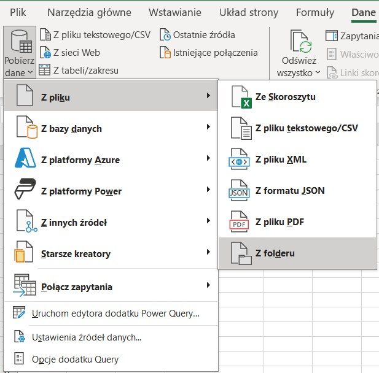
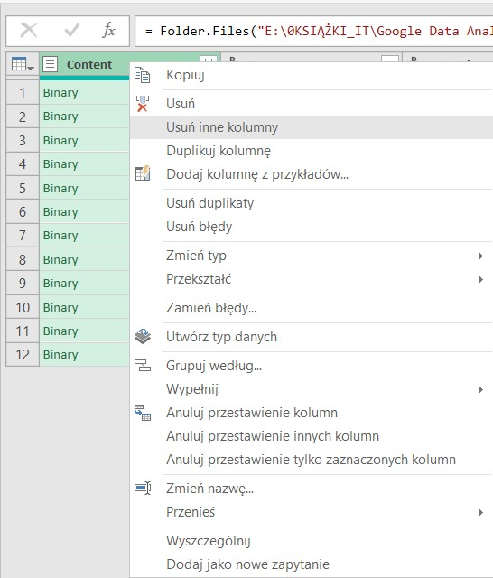

- What are the inital observations with this dataset? What has caught my attention?

1. First, using the 'Count rows' founction, I counted the total number of records, after checking for any initial errors:

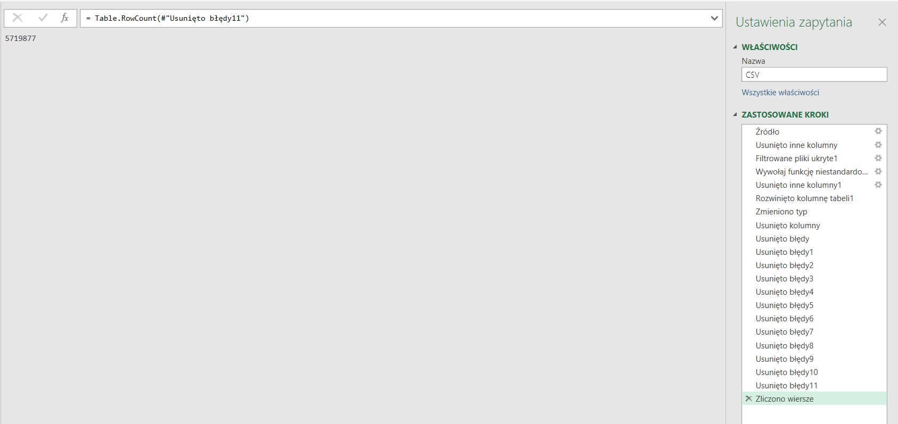
   
2. Next, I checked for errors and null values. By filtering each column, I have found null values in the 'start_station_name' and 'end_station_name' columns:

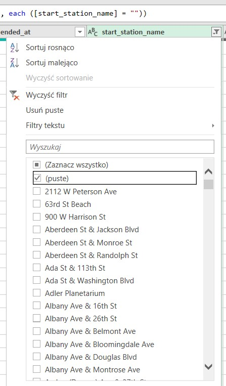
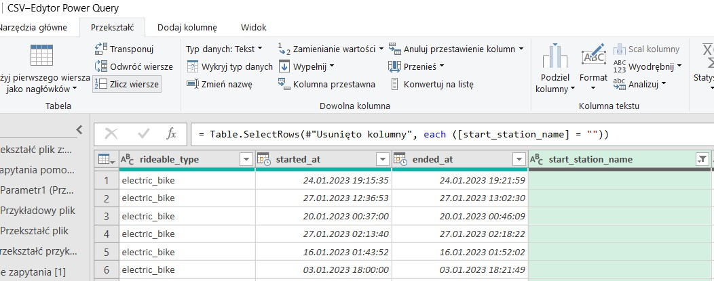
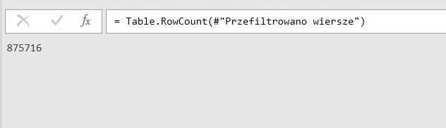
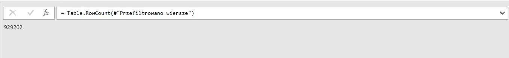

Using the 'Count rows' function, I have found that there are 875716 missing values in the 'start_station_name' column and 929202 missing values in the 'end_station_name' column.

In a real-life scenario I would ask the stakeholders, engaged in the project, or someone above me in the chain of command to discuss possible causes of those null values and what would be the steps to avoid them in the future. I would also hold discussions about way to compensate for those missing values, without introducing any kind of bias into the data.

For this case study, I have decided to keep all of the records, as most of the analysis is time/date oriented, only omitting the missing values when creating the geolocation portion of the interactive dashboard in Tableau.

3. In the 'member_casual' column, the 'casual' string value refers to any rides that were not membership rides (there is no distinction between single-ride or day-pass users). This is due to Customer Protection laws, which do not allow to store data about card payments. For this reason we also can not record how many times a single customer made recurring purchases.

4. The dataset does not contain information about the distance rode per trip, which would be a valuable piece of information. Most of the insights are therefore based on the ride duration and ride count metrics, supported by geolocation records.


## Data cleaning

- The aim is to refine the dataset to ensure it is structured and ready for analysis.
- Only relevant columns should be retained.
- Certain columns have to be split into a number of new ones to generate more insights.
- Certain columns can to be merged to keep the data readable and more usable for analysis.
- All data types should be appropriate for the contents of each column.

Below is a picture of the schema for the data before cleaning:

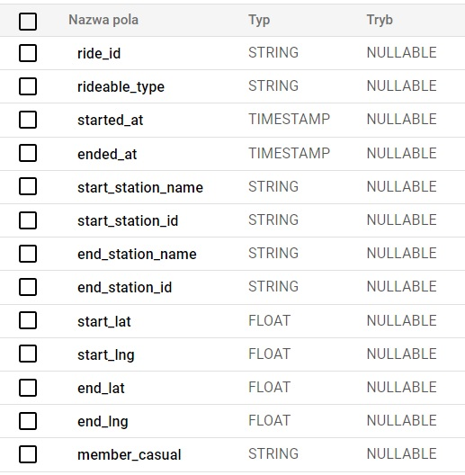

What are the needed steps to cleand and shape the data into a desired format?

1. Merge the 12 datasets for each month in SQL, as the file size was too big to export using Excel/Power Query. Avoid creating duplicate rows doing so.
2. Remove unnecessary columns by not including them in the query.
3. Split the TIMESTAMP value columns ('started_at', 'ended_at') into time, date, day and month columns to allow for more specific analysis.
4. Rename columns using aliases.


## Data transformation


```sql
/*
Merge 12 datasets, utilising UNION DISTINCT to avoid duplicate rows.
*/

SELECT *
FROM `cyclistic-case-study-427019.Cyclistic_data_2023.df23_01`
UNION DISTINCT
SELECT *
FROM `cyclistic-case-study-427019.Cyclistic_data_2023.df23_02`
UNION DISTINCT
.
.
.
SELECT *
FROM `cyclistic-case-study-427019.Cyclistic_data_2023.df23_12

```

After running the query, use the BigQuery functionality to save the results as a BigQuery Table:


Moving on to the data transformation itself:

```sql
/*
# 1. Select and rename appropriate columns using aliases
# 2. Split the started_at column by extracting appropriate values
# 3. Split the ended_at column by extracting appropriate values
# 4. Calculate the ride duration for each row
# 5. Merge columns to create a RouteName column, later used for ranking most popular bike routes
*/

-- 1.
SELECT
  member_casual AS MembershipType,
  rideable_type AS BikeType,
  started_at AS StartTimeStamp,

-- 2.
  EXTRACT(TIME FROM started_at) AS StartTime,
  EXTRACT(DATE FROM started_at) AS StartDate,
  FORMAT_DATE('%A', started_at) AS StartDay,
  FORMAT_DATE('%B', started_at) AS StartMonth,
  ended_at AS ReturnTimeStamp,

-- 3.
  EXTRACT(TIME FROM ended_at) AS ReturnTime,
  EXTRACT(DATE FROM ended_at) AS ReturnDate,
  FORMAT_DATE('%A', ended_at) AS ReturnDay,
  FORMAT_DATE('%B', ended_at) AS ReturnMonth,

-- 4.
  TIMESTAMP_DIFF(ended_at, started_at, MINUTE) AS Duration,

-- 5.
  CONCAT(start_station_name, " - ", end_station_name) AS RouteName,

-- Rename geolocation columns for consistency
  start_lat AS StartLat,
  start_lng AS StartLng,
  end_lat AS ReturnLat,
  end_lng AS ReturnLng

FROM
  `cyclistic-case-study-427019.Cyclistic_data_2023.df23_all`

```

Below is a picture of the schema for the data after cleaning and transformation:

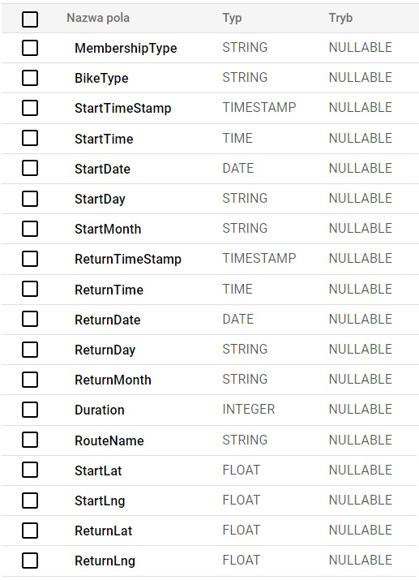

# R code

## Preparation

In order to make the dataset useable in the RStudio and Tableau enviroments it is exported from BigQuery as a .csv file. Due to its size, it first has to be exported to an interconnected Google Drive, and then it can be downloaded locally.

Load the following packages which suit our analysis approach and load our dataset:

```R
library(tidyverse) # collection of packages used to import, tidy, transform, visualize and model data
library(ggrepel) # to repel overlapping text labels from the ggplot2 package from tidyverse
library(scales) # override the default breaks, labels, transformations and palettes used for scales by ggplot2
library(extrafont) # register custom fonts

trip_data <- read_csv("Data_cleaned.csv")

```

## Calculation and Visuals

```R
counts <- trip_data %>%
  group_by(MembershipType) %>%
  count() %>%
  ungroup() %>% 
  mutate(perc = `n` / sum(`n`)) %>% 
  arrange(perc) %>% 
  mutate(labels = scales::percent(perc))

positions <- counts %>% 
  mutate(csum = rev(cumsum(rev(perc))), 
         pos = perc/2 + lead(csum, 1),
         pos = if_else(is.na(pos), perc/2, pos))

ggplot(counts, aes(x = "", y = perc, fill = MembershipType)) +
  geom_col(color = "white") +
  geom_text(aes(label = comma(n)),
            position = position_stack(vjust = 0.5), color = "white") +
  coord_polar(theta = "y") +
  scale_fill_brewer(palette = "Dark2") +
  geom_label_repel(data = positions,
                   aes(y = pos, label = labels),
                   size = 4, nudge_x = 0.6, show.legend = FALSE, min.segment.length = Inf, color = "white", family = "Tahoma") +
  ggtitle(paste("Total riders in 2023:", comma(nrow(trip_data)))) +
  theme_void(base_family = "Tahoma") +  # Change base font family
  theme(
    plot.title = element_text(size = 14, face = "bold"),
    legend.title = element_text(size = 12, face = "bold"),
    legend.text = element_text(size = 10)
  )

```
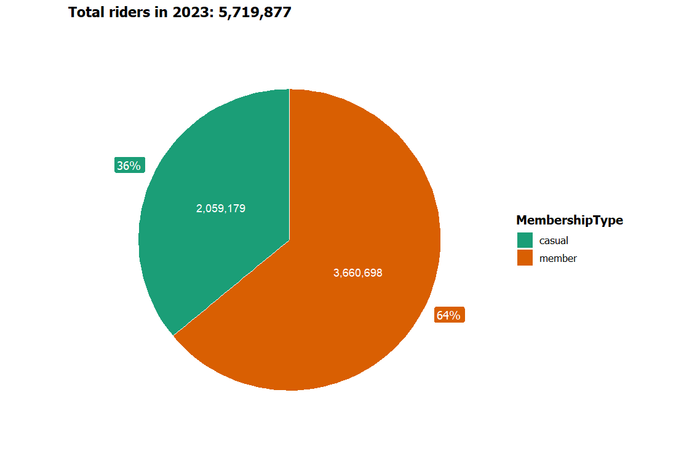


```R
days_descending <- c("Sunday", "Saturday", "Friday", "Thursday", "Wednesday", "Tuesday", "Monday")

ggplot(data = trip_data) +
  geom_bar(mapping = aes(x = factor(StartDay, level = days_descending), fill = MembershipType),
           position = position_dodge()) +
  geom_text(
    stat = 'count', 
    aes(x = factor(StartDay, levels = days_descending), label = comma(..count..), group = MembershipType), 
    position = position_dodge(width = 0.9),
    hjust = 1.5,
    color = "white",
    size = 3,
    face = "bold",
    family = "Tahoma"
  ) +
  xlab("Day of the week") + 
  ylab("Count") +
  scale_y_continuous(labels = comma) +
  coord_flip() +
  ggtitle("Daily Riders") +
  scale_fill_brewer(palette = "Dark2") +
  theme_minimal(base_family = "Tahoma") +  # Change base font family
  theme(
    plot.title = element_text(size = 14, face = "bold"),
    axis.title.x = element_text(size = 12, face = "bold", margin = margin(t = 10)),  # Move x-axis title
    axis.title.y = element_text(size = 12, face = "bold", margin = margin(r = 10)),  # Move y-axis title
    axis.text = element_text(size = 10),
    legend.title = element_text(size = 12, face = "bold"),
    legend.text = element_text(size = 10)
  )

```
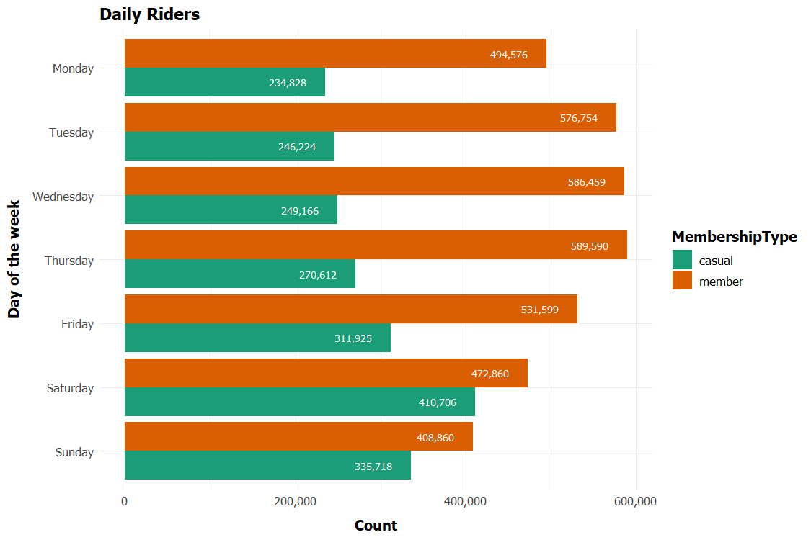


```R
months_descending <- c("December", "November", "October", "September", "August", "July", "June", "May", "April", "March", "February", "January")

ggplot(data = trip_data) +
  geom_bar(mapping = aes(x = factor(StartMonth, level = months_descending), fill = MembershipType),
           position = position_dodge()) +
  geom_text(
    stat = 'count', 
    aes(x = factor(StartMonth, levels = months_descending), label = comma(..count..), group = MembershipType), 
    position = position_dodge(width = 0.9),
    hjust = 1.5,
    color = "white",
    size = 3,
    face = "bold",
    family = "Tahoma"
  ) +
  xlab("Month") + 
  ylab("Count") +
  scale_y_continuous(labels = comma) +
  coord_flip() +
  ggtitle("Monthly Riders") +
  scale_fill_brewer(palette = "Dark2") +
  theme_minimal(base_family = "Tahoma") +  # Change base font family
  theme(
    plot.title = element_text(size = 14, face = "bold"),
    axis.title.x = element_text(size = 12, face = "bold", margin = margin(t = 10)),  # Move x-axis title
    axis.title.y = element_text(size = 12, face = "bold", margin = margin(r = 10)),  # Move y-axis title
    axis.text = element_text(size = 10),
    legend.title = element_text(size = 12, face = "bold"),
    legend.text = element_text(size = 10)
  )

```
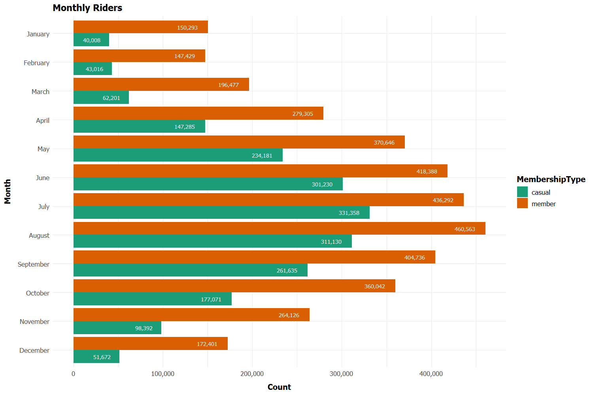

```R
averages <- trip_data %>%
  group_by(StartDay, MembershipType) %>%
  summarise(average_duration = mean(Duration)) %>% 
  as.data.frame()

ggplot(data = averages) +
  geom_col(mapping = aes(x = factor(StartDay, level = days_descending), y = average_duration, fill = MembershipType)) +
  geom_text(aes(x = factor(StartDay, level = days_descending), y = average_duration, label = round(average_duration, 1)), 
            position = position_dodge(width = 0.9),
            hjust = 2,
            color = "white",
            size = 3,
            face = "bold",
            family = "Tahoma"
            ) +
  coord_flip() + 
  xlab("Day of the week") + 
  ylab("Average ride duration (minutes)") + 
  ggtitle("Average ride duration") +
  facet_wrap(~MembershipType, ncol = 1) +
  scale_fill_brewer(palette = "Dark2") +
  theme_minimal(base_family = "Tahoma") +  # Change base font family
  theme(
    plot.title = element_text(size = 14, face = "bold"),
    axis.title.x = element_text(size = 12, face = "bold", margin = margin(t = 10)),  # Move x-axis title
    axis.title.y = element_text(size = 12, face = "bold", margin = margin(r = 10)),  # Move y-axis title
    axis.text = element_text(size = 10),
    legend.title = element_text(size = 12, face = "bold"),
    legend.text = element_text(size = 10)
  )

```
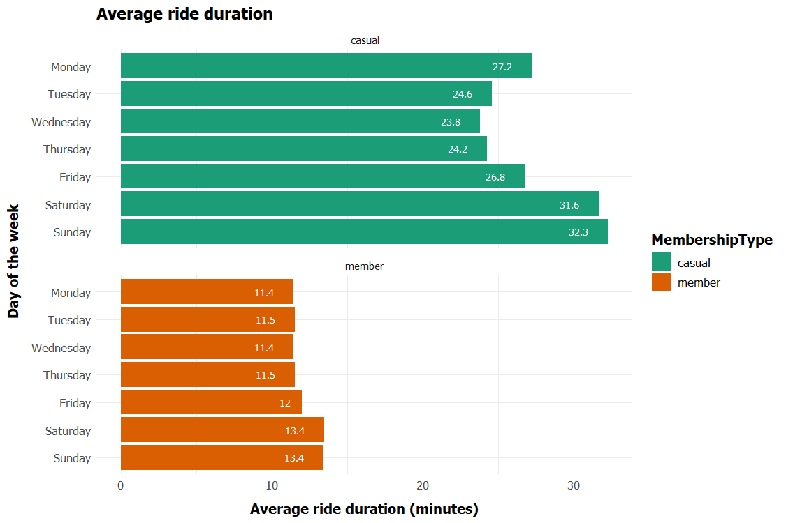


```R   
ggplot(data = trip_data) +
  geom_bar(mapping = aes(x = BikeType, fill = MembershipType), position = position_dodge()) +
  geom_text(stat = "count", aes(x = BikeType, label = comma(..count..), group = MembershipType), 
            position = position_dodge(width = 0.9),
            vjust = 2,
            color = "white",
            size = 3,
            face = "bold",
            family = "Tahoma"
            ) +
  xlab("Bike Type") +
  ylab("Count") +
  ggtitle("Bike types vs Membership type") +
  scale_y_continuous(labels = comma) +
  scale_fill_brewer(palette = "Dark2") +
  theme_minimal(base_family = "Tahoma") +  # Change base font family
  theme(
    plot.title = element_text(size = 14, face = "bold"),
    axis.title.x = element_text(size = 12, face = "bold", margin = margin(t = 10)),  # Move x-axis title
    axis.title.y = element_text(size = 12, face = "bold", margin = margin(r = 10)),  # Move y-axis title
    axis.text = element_text(size = 10),
    legend.title = element_text(size = 12, face = "bold"),
    legend.text = element_text(size = 10)
  )

```

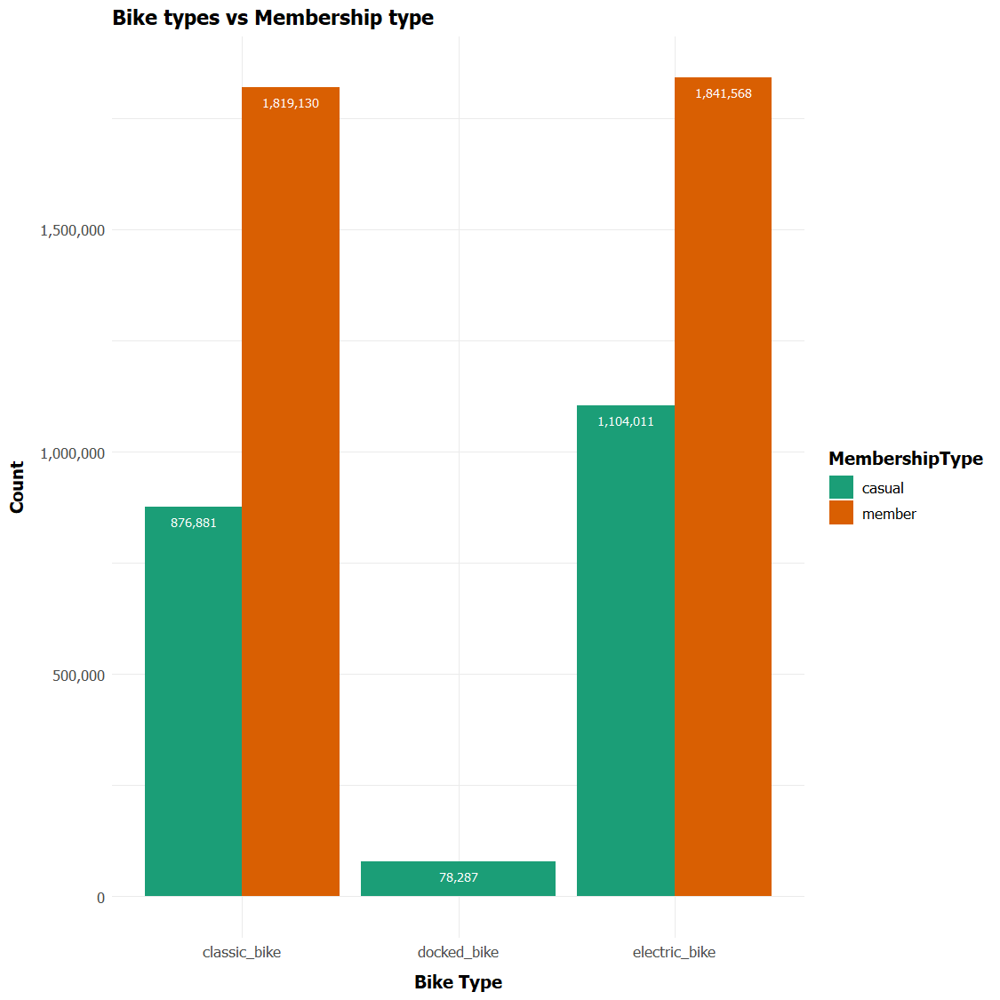


